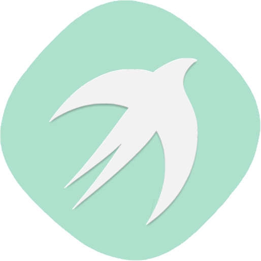

<p align="center">
  
</p>

# Electron Photonkit Boilerplate
Boilerplate built on electron and photonkit with tabs rendering so you can focus on building the app. It uses the Fetch API to route javascript html and css of the necessary called pages for dynamic routing.

Consider it like href but for single page apps where you only href the necessary content you want to change.
## Getting Started
```
git clone https://gitlab.com/xaander1/electron-photonkit-boilerplate.git myapp
cd myapp
npm install
```
## Usage

### Import the neccessary modules
```
const { Tabs,listenForClicks,listenForNestedClicks } = require ('./src/tabsrouter.js');

```

### Tabs
Its written in javascript promises and returns `success` once routing is done.
It mostly does the page routing and it takes in 3 arg's.
* *arg 1 :* The class name that belongs to all the tabs buttons *(enables resolving which tab is active)*
* *arg 2 :* The **id tag** where the content is going to be injected.
* *arg 3 :* The **url** of the page to load

### listenForClicks

This creates event listeners for clicks in the tabs.


It takes 2 arg's

* *arg1:*  The class name that belongs to all the tabs buttons *(enables resolving which tab is active)*
* *arg 2:* The folder in manview

For simplicity sakes in order for tabs router to work the following structure must be followed.

The `sidebar` contains html files

The `mainview` contains a folders or folder then all html files

The `id's` of the the tab buttons in `index.html` is the name of the `htm` elements in sidebar.

The `id's` of the the tab buttons in `index.html` is the name of the folders in `mainview`

The  `id's` of the tabs inside *sidebar* html's i.e `default.htm` is the name of the files in the folder they belong to where the folder name is the name of the `id` tab buttons in `index.html`   

### listenForNestedClicks
This is the master of all of them it creates nested event listeners

It takes 3 arg's

* *arg1:* The common class of all tab buttons on `index.html`
* *arg2:* The default body to load. its recommened each folder in mainview to have a default
* *arg3:* The common class of all tab buttons on sidebar html's *(all sidebars tab buttons should have a similar classname)*


 If your app does not contain sidebar you can just use the two modules ` listenForClicks` and `Tabs` or just `Tabs` if you like ` listenForClicks` relies on `Tabs` while `listenForNestedClicks` relies on `Tabs` and `listenForClicks`.

 The code that does our magic is in `src` folder. Feel free to edit it to fit your needs.


## Authors

* **Alexander Njogu** - *Initial work* - [gitlab](https://gitlab.com/xaander1)

## License

This project is licensed under the MIT License - see the [LICENSE.md](LICENSE.md) file for details
